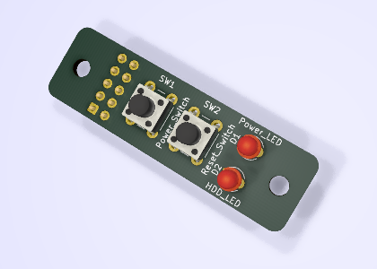

# Micro 8088 Front Panel
Front Panel for [Micro 8088](https://github.com/skiselev/micro_8088) and [ISA 8-Bit Backplane](https://github.com/skiselev/isa8_backplane) Based Computer

## Introduction
This front panel intended to be used with [Micro 8088](https://github.com/skiselev/micro_8088)
and [ISA 8-Bit Backplane](https://github.com/skiselev/isa8_backplane) based computer.
It features the standard [Intel* front panel pinout](https://www.intel.com/content/www/us/en/support/articles/000005643/boards-and-kits/desktop-boards.html), and can work with other systems as well.

## Hardware Documentation

### Schematic and PCB Layout

[Schematic - Version 1.0](KiCad/Micro_8088_Front_Panel-Schematic-1.0.pdf)

[PCB Layout - Version 1.0](KiCad/Micro_8088_Front_Panel-Board-1.0.pdf)

### Jumpers, Connectors, and Switches

#### J1 - Front Panel Connector
Pin | Description                  | Pin | Description
--- | ---------------------------- | --- | -------------------
1   | HDD Activity LED Anode (+)   | 2   | Power LED Anode (+)
3   |	HDD Activity LED Cathode (-) | 4   | Power LED Cathode (-)
5   |	Reset Switch (Ground)        | 6   | Power Switch (Output)
7   |	Reset Switch (Output)        | 8   | Power Switch (Ground)
9   |	5V (Unused)                  | 10  | Key (Pin removed)

#### SW1 - Power Switch
Press SW1 to turn on/off the system

#### SW2 - Reset Switch
Press SW2 to reset the system

### Bill of Material - Version 1.0

[Micro 8088 Front Panel project on Mouser.com](https://www.mouser.com/ProjectManager/ProjectDetail.aspx?AccessID=e9e37fe2f8) - View and order all components except of the PCB.
[Micro 8088 Front Panel project on OSH Park](https://oshpark.com/shared_projects/V4toeD34) - View and order the PCB.

Component type     | Reference | Description                       | Quantity | Possible sources and notes 
------------------ | --------- | --------------------------------- | -------- | --------------------------
PCB                |           | Micro 8080 Front Panel PCB V1.0   | 1        | OSH Park [Micro 8088 Front Panel V1.0](https://oshpark.com/shared_projects/V4toeD34) Alternatively order from a PCB manufacturer of your choice using provided KiCad files
LED                | D1        | 3 mm, blue LED indicator          | 1        | Mouser [604-WP710A10QBC/D](https://www.mouser.com/ProductDetail/604-WP710A10QBC-D) Alternatively use 3 mm green LED Note: Intel* specifies a bi-color green/yellow LED
LED                | D2        | 3 mm, pink LED indicator          | 1        | Mouser [604-WP7104VRVCWA](https://www.mouser.com/ProductDetail/604-WP7104VRVCWA) Alternatively use 3 mm yellow LED
Tactile Button     | SW1, SW2  | 6 mm tactile button, projected    | 2        | Mouser [653-B3F-1150](https://www.mouser.com/ProductDetail/653-B3F-1150)
Key Cap            | SW1       | Omron 4x4 mm key cap, blue        | 1        | Mouser [653-B32-1040](https://www.mouser.com/ProductDetail/653-B32-1040)
Key Cap            | SW2       | Omron 4x4 mm key cap, red         | 1        | Mouser [653-B32-1080](https://www.mouser.com/ProductDetail/653-B32-1080)
Pin Header         | J1        | 2x5 pin header, 2.54 mm pitch     | 1        | Mouser [855-M20-9980545](https://www.mouser.com/ProductDetail/855-M20-9980545)
