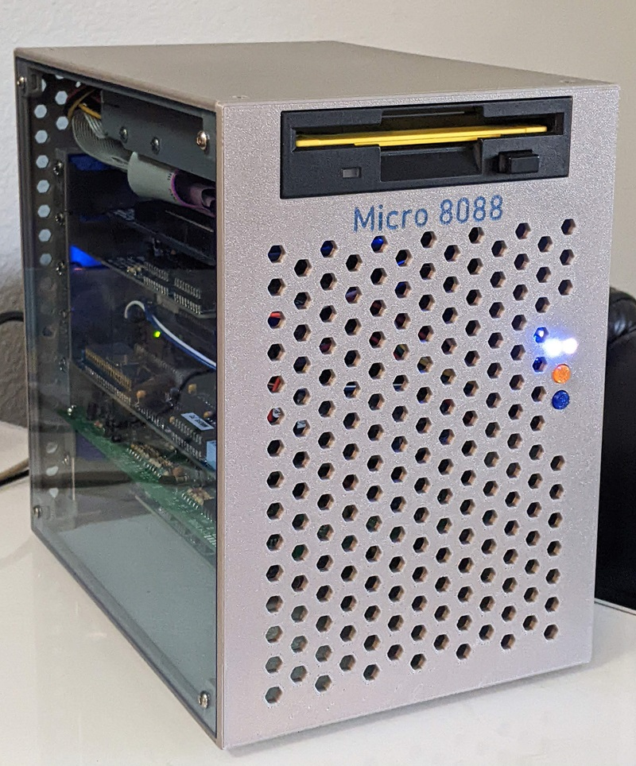

# Micro 8088 Case
Case for [Micro 8088](https://github.com/skiselev/micro_8088) and [ISA 8-Bit Backplane](https://github.com/skiselev/isa8_backplane) Based Computer

## Introduction
This case is intended to be used with [Micro 8088](https://github.com/skiselev/micro_8088)
and [ISA 8-Bit Backplane](https://github.com/skiselev/isa8_backplane) based computer.

The front panel features the standard [Intel* front panel pinout](https://www.intel.com/content/www/us/en/support/articles/000005643/boards-and-kits/desktop-boards.html), and can work with other systems as well.

## Hardware Documentation

### 3D Printed Parts

Parts can be printed using PETG or other fillament. The parts are designed to be printed without supports, with the exception of the case back, which needs supports for the DC power connector area.

Part            | File                                                                                               | Notes
--------------- | -------------------------------------------------------------------------------------------------- | ------------------------------------------------------------------
Case Front      | [case_front.stl](https://github.com/skiselev/micro_8088_case/blob/master/printed/case_front.stl)   | For the system name in colored letters, print sytem_name.stl first
Case Back       | [case_back.stl](https://github.com/skiselev/micro_8088_case/blob/master/printed/case_back.stl)     |
Case Bottom     | [case_bottom.stl](https://github.com/skiselev/micro_8088_case/blob/master/printed/case_bottom.stl) | Use supports on the build plate only option when printing
Case Top        | [case_top.stl](https://github.com/skiselev/micro_8088_case/blob/master/printed/case_top.stl)       | It is possible to use a 192.8 mm * 192.8 mm piece of transparent 1/8" / 3 mm acrylic plastic instead
Case Left       | [case_left.stl](https://github.com/skiselev/micro_8088_case/blob/master/printed/case_left.stl)     |
Case Right      | [case_right.stl](https://github.com/skiselev/micro_8088_case/blob/master/printed/case_right.stl)   |
ISA Slots Cover | [slots_cover.stl](https://github.com/skiselev/micro_8088_case/blob/master/printed/slots_cover.stl) | Snaps into the Case Back
Speaker Bracket | [speaker_bracket.stl](https://github.com/skiselev/micro_8088_case/blob/master/printed/speaker_bracket.stl) |
System Name     | [system_name.stl](https://github.com/skiselev/micro_8088_case/blob/master/printed/system_name.stl) | System Name "Micro 8088". Print and remove the rectangle on the perimeter. Next print case_front.stl
Keycaps         | [keycap_6mm_round.stl](https://github.com/skiselev/micro_8088_case/blob/master/printed/keycap_6mm_round.stl) | Print two using colorful plastic. It is recommended to print several keycaps at the time. [Omron B32-2000](https://www.mouser.com/ProductDetail/653-B32-2000) keycaps can be used instead

### Other Parts

Part                       | Quantity  | Notes
-------------------------- | --------- | -----
M3 x 8 mm flat head screws | 16        | Hold case sides together
M3 x 1.8 mm square nuts    | 16        | Hold case sides together
M3 x 8 mm pan head screws  | 6         | Floppy drive
M3 x 6 mm pan head screws  | 15        | Backplane - 6 screws, front panel - 2 screws, ISA cards - 7 screws

### Front Panel Schematic and PCB Layout

[Schematic - Version 1.0](KiCad/Micro_8088_Front_Panel-Schematic-1.0.pdf)

[PCB Layout - Version 1.0](KiCad/Micro_8088_Front_Panel-Board-1.0.pdf)

### Jumpers, Connectors, and Switches

#### J1 - Front Panel Connector
Pin | Description                  | Pin | Description
--- | ---------------------------- | --- | -------------------
1   | HDD Activity LED Anode (+)   | 2   | Power LED Anode (+)
3   |	HDD Activity LED Cathode (-) | 4   | Power LED Cathode (-)
5   |	Reset Switch (Ground)        | 6   | Power Switch (Output)
7   |	Reset Switch (Output)        | 8   | Power Switch (Ground)
9   |	5V (Unused)                  | 10  | Key (Pin removed)

#### SW1 - Power Switch
Press SW1 to turn on/off the system

#### SW2 - Reset Switch
Press SW2 to reset the system

### Bill of Material - Version 1.0

[Micro 8088 Front Panel project on Mouser.com](https://www.mouser.com/ProjectManager/ProjectDetail.aspx?AccessID=e9e37fe2f8) - View and order all components except of the PCB.
[Micro 8088 Front Panel project on OSH Park](https://oshpark.com/shared_projects/V4toeD34) - View and order the PCB.

Component type     | Reference | Description                       | Quantity | Possible sources and notes 
------------------ | --------- | --------------------------------- | -------- | --------------------------
PCB                |           | Micro 8080 Front Panel PCB V1.0   | 1        | OSH Park [Micro 8088 Front Panel V1.0](https://oshpark.com/shared_projects/V4toeD34) Alternatively order from a PCB manufacturer of your choice using provided KiCad files
LED                | D1        | 3 mm, blue LED indicator          | 1        | Mouser [604-WP710A10QBC/D](https://www.mouser.com/ProductDetail/604-WP710A10QBC-D) Alternatively use 3 mm green LED Note: Intel* specifies a bi-color green/yellow LED
LED                | D2        | 3 mm, pink LED indicator          | 1        | Mouser [604-WP7104VRVCWA](https://www.mouser.com/ProductDetail/604-WP7104VRVCWA) Alternatively use 3 mm yellow LED
Tactile Button     | SW1, SW2  | 6 mm tactile button, projected    | 2        | Mouser [653-B3F-1052](https://www.mouser.com/ProductDetail/653-B3F-1052), [653-B3F-1050](https://www.mouser.com/ProductDetail/653-B3F-1050)
Key Cap            | SW1, SW2  | Omron 6 mm round key cap, black   | 2        | Mouser [653-B32-2000](https://www.mouser.com/ProductDetail/653-B32-2000)
Pin Header         | J1        | 2x5 pin header, 2.54 mm pitch     | 1        | Mouser [855-M20-9980545](https://www.mouser.com/ProductDetail/855-M20-9980545)
